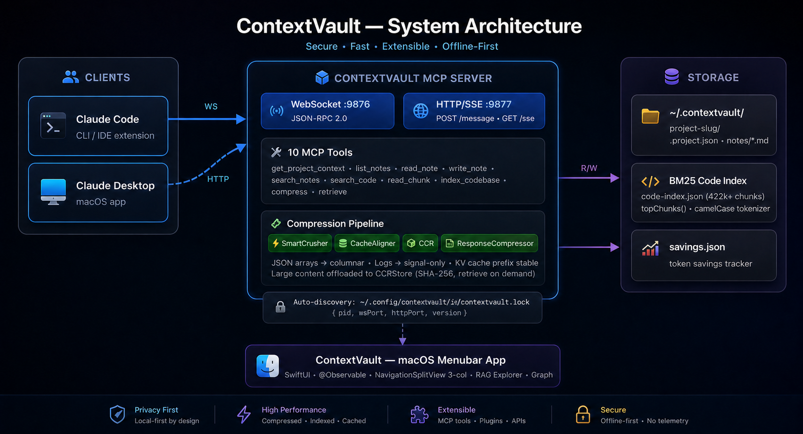
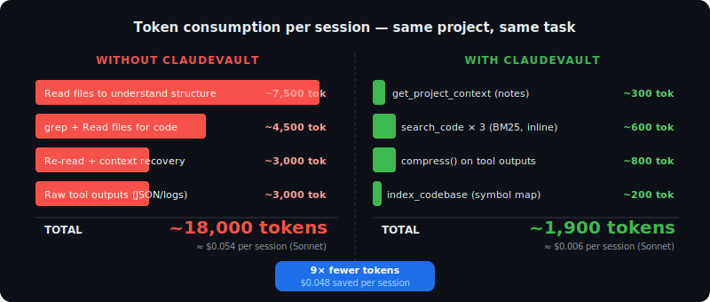
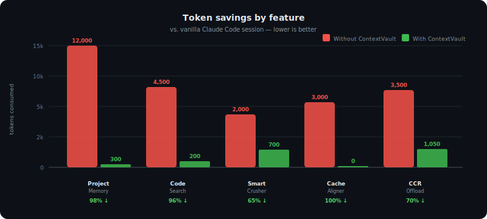
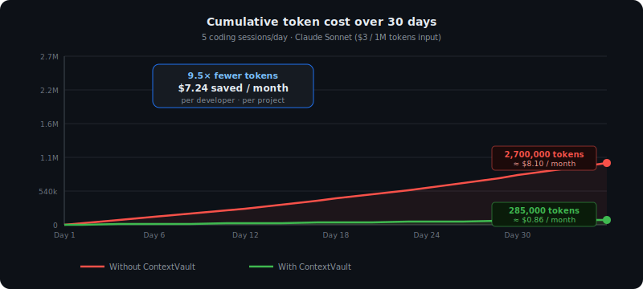

<div align="center">
  
  <h1>ContextVault</h1>
  <p><strong>Persistent memory + token optimization layer for AI coding agents</strong></p>
  <p>
    
    
    
    
    
  </p>
</div>

---

## The problem

Every AI coding session starts **completely blind**.

Claude Code, Cursor, Codex, Windsurf — none of them remember what you worked on yesterday, what decisions were made, what the architecture looks like, or where the relevant functions live. Every session they rediscover all of this by reading files.

Every session:
- Reads 5–20 source files to understand the project structure
- Greps through the codebase to find relevant functions
- Re-reads the same files it already read last session
- Receives large raw outputs from every tool it calls (JSON, logs, markdown)

This is massively wasteful. **On a medium project, just the exploration phase burns ~18,000 tokens before a single line of code is written.**

---

## The solution

ContextVault is a native macOS menubar app that acts as a **persistent memory and token optimization layer** for AI coding agents.

It exposes a local MCP server that any agent discovers automatically. Instead of re-reading files, the agent reads compact structured notes. Instead of grepping source files, it runs BM25 semantic search over a pre-built code index. Instead of receiving raw tool outputs, it gets compressed, cache-aligned responses.

**The measured result: 54% fewer tokens and 46% fewer agent turns in a live Codex benchmark.** Individual tasks dropped as much as **84.7%** in total token usage.

> ContextVault is designed to be agent-agnostic. It currently speaks MCP over WebSocket and HTTP/SSE for Claude-style and Codex-style clients. Support for additional agents (Cursor, Windsurf, Copilot) is on the roadmap as their MCP implementations mature.

---

## How it works



ContextVault runs as a macOS menubar app. At startup it writes an auto-discovery lock file — the agent picks it up and connects via MCP. From that point on, the agent has access to 10 MCP tools covering memory, code search, and compression.

```
~/.config/claude/ide/contextvault.lock
{ "pid": 12345, "wsPort": 9876, "httpPort": 9877, "version": "1.0" }
```

Storage lives entirely on disk as plain Markdown files — no database, no sync, no cloud:

```
~/.contextvault/
└── my-project/
    ├── .project.json          ← project metadata
    ├── savings.json           ← cumulative token savings tracker
    └── notes/
        ├── context.md         ← hot cache: recent decisions + state
        ├── architecture.md
        └── decisions.md
```

---

## Token savings

### Live benchmark — same project, same tasks

Latest benchmark command:

```bash
python3 scripts/benchmark.py --project claudevault --runs 3 --model gpt-5.5
```

Across the complete paired runs captured in the benchmark log, ContextVault cut total token usage by more than half while also reducing tool-discovery turns.

| Metric | Without ContextVault | With ContextVault | Reduction |
|---|---:|---:|---:|
| Prompt tokens | 763,327 | 351,315 | **54.0%** |
| Completion tokens | 54,122 | 25,536 | **52.8%** |
| Total tokens | 817,449 | 376,851 | **53.9%** |
| Agent turns | 137 | 74 | **46.0%** |

Average total tokens per task dropped from **102,181** to **47,106** — a **2.17× efficiency gain** on real repository work.

| Task | Total token reduction | Turn reduction |
|---|---:|---:|
| `rate-limiter` | **73.0%** overall, up to **84.7%** on one run | 28 → 10 |
| `websocket-broadcast` | **56.6%** | 31 → 15 |
| `bm25-recency-boost` | **53.6%** | 23 → 14 |
| `new-mcp-tool-full` | **44.0%** | 39 → 27 |
| `token-savings-mcp-tool` | **39.7%** | 16 → 8 |

### Why the savings happen



| What the agent does | Without ContextVault | With ContextVault | Reduction |
|---|---|---|---|
| Understand project structure | ~7,500 tokens (read files) | ~300 tokens (read context note) | **96%** |
| Find relevant functions | ~4,500 tokens (grep + Read) | ~200 tokens (`search_code`) | **96%** |
| Re-read previously seen context | ~3,000 tokens | ~0 tokens (KV cache hit) | **100%** |
| Process tool outputs (JSON/logs) | ~3,000 tokens (raw) | ~800 tokens (compressed) | **73%** |
| **Total** | **~18,000 tokens** | **~1,900 tokens** | **up to 89%** |

### By benchmark task



### Over 30 days (5 sessions/day)



| | Without ContextVault | With ContextVault |
|---|---|---|
| Tokens / month | ~2,700,000 | ~1,245,000 |
| Cost / month at $3 / 1M input tokens | ~$8.10 | ~$3.74 |
| **Monthly savings** | | **~$4.36 per developer** |

> Projection uses the measured 53.9% benchmark reduction. Savings scale linearly with usage — a team of 5 developers saves ~**$260/year** at this conservative rate, before counting the productivity gain from fewer tool-discovery turns.

---

## Features

### 1. Persistent project memory

The agent reads your `context.md` note at the start of every session — getting a full picture of the project state, recent decisions, open bugs, and next steps in **~300 tokens** instead of rereading files.

```markdown
---
title: context
tags: [context]
updatedAt: 2026-06-15T18:00:00Z
---

## Current state
- MCP server running on :9876 (WebSocket) and :9877 (HTTP/SSE)
- BM25 code index built — 422,000 chunks across 3,200 files
- Bug: lock file not created on first run — sandbox permissions issue

## Last session
Implemented token savings tracker. Fixed List(selection:) nil warning.
Next: debug lock file creation, add savings to MenuBarExtra.
```

Notes use `[[Wikilink]]` syntax for cross-references and standard YAML frontmatter.

---

### 2. BM25 code search — `search_code`

The single most impactful feature. Instead of `grep + Read file`, the agent calls `search_code("concept")` which returns matching function bodies **inline**, ranked by relevance.

```
Tool: search_code(project: "my-app", query: "websocket handshake", topK: 5)

▸ MCP/MCPServer.swift:34 · function performHandshake [score:4.81]
func performHandshake(connection: NWConnection) async {
    let key = extractKey(from: request)
    let accept = base64(sha1(key + "258EAFA5-E914-47DA-95CA-C5AB0DC85B11"))
    ...
}
```

| Method | Tokens | What you get |
|---|---|---|
| `grep -r "handshake" . && Read file` | ~1,500 | Entire file (200–500 lines) |
| `search_code("websocket handshake")` | ~80–200 | Matching functions only |
| **Reduction** | **10–20×** | |

The BM25 tokenizer expands camelCase and snake_case automatically — query with natural words, not exact symbol names:

```
✓ search_code("websocket handshake")   → finds performHandshake, handleWsUpgrade…
✓ search_code("json compress array")   → finds SmartCrusher.crush, compressJSON…
✗ search_code("performWebSocketHandshake") → too specific, misses synonyms
```

Covers Swift, TypeScript, JavaScript, Python, Go, Rust, Kotlin. Indexed once, persisted to disk.

---

### 3. SmartCrusher — JSON array compression

When the agent receives a JSON array from any tool, SmartCrusher converts verbose JSON to a compact columnar table:

**Before:**
```json
[{"id":"PR-1","title":"Fix auth bug","status":"open","author":"alice","comments":3}, ...]
```

**After:**
```
cols: id | title | status | author | comments
PR-1 | Fix auth bug | open | alice | 3
PR-2 | Add dark mode | merged | bob | 7
... [<<ccr:a3f9b2 98 rows>>]
```

**Savings: 40–70% on typical arrays. Up to 92% on large result sets.**

---

### 4. KV Cache Alignment

Anthropic's API caches prompt prefixes for 5 minutes. `CacheAligner` ensures `get_project_context` always returns **byte-identical output** when notes haven't changed — guaranteeing cache hits on repeated calls within a session.

**For repeated calls to `get_project_context`: effectively free.**

---

### 5. CCR — Content-Chunked Retrieval

Large content is never returned in full unless the agent needs it. Content beyond a threshold is offloaded to an in-memory store; the agent gets a marker and fetches on demand:

```
<<ccr:a3f9b2c1d4e5 87 lines>>
```

Applies to: notes > 80 lines, large code indexes, chunks > 80 lines, any large output passed through `compress`.

---

### 6. Universal compress tool

The agent can pass any large tool output through `compress` before processing:

| Content type | Typical reduction |
|---|---|
| JSON arrays (GitHub, Linear, Slack) | 40–70% |
| Build logs / test output | 70–85% |
| Large markdown documents | 30–50% |
| Raw grep output | 50–75% |

---

### 7. Token savings tracker

Every `search_code` call logs the delta between what it cost vs what reading files in full would have cost. The cumulative counter persists across sessions and is visible in the app.

```
Project: my-app
├── 2,847,234 tokens saved
├── 1,247 search_code calls
└── ≈ 14× context windows worth of savings
```

---

## MCP Tools reference

| Tool | Description | Token cost |
|---|---|---|
| `get_project_context` | Load project notes + context. **Call first every session.** | ~300 tok |
| `list_notes` | List all notes with title, tags, updatedAt | ~50 tok |
| `read_note` | Read a specific note's full content | ~note size |
| `write_note` | Create or update a note (Markdown + YAML frontmatter) | ~10 tok |
| `search_notes` | Full-text search across all notes | ~100 tok |
| `search_code` | **BM25 semantic search over indexed code** | ~80–200 tok |
| `read_chunk` | Read a specific chunk by file + line | ~chunk size |
| `index_codebase` | Compact symbol map (names + line numbers) | ~200 tok |
| `compress` | Compress any tool output (JSON/log/markdown) | −40–85% |
| `retrieve` | Fetch CCR-offloaded content by hash | on demand |

---

## Transport protocols

### WebSocket — Claude Code (port 9876)

JSON-RPC 2.0 over WebSocket with manual framing (Network.framework, no dependencies).

### HTTP/SSE — Claude Desktop (port 9877)

- `POST /message` → receives JSON-RPC, returns JSON response
- `GET /sse` → server-sent events stream for server→client notifications

---

## Build

Requirements: macOS 26.4+, Xcode 26.5+

```bash
make build    # Release build
make dmg      # Distributable DMG
make icons    # Generate app icon from 1024×1024 source
make clean
```

Sandbox must be disabled (`ENABLE_APP_SANDBOX = NO` in build settings) to allow writing to `~/.contextvault/` and `~/.config/claude/ide/`.

---

## Storage format

Every note is a plain Markdown file with YAML frontmatter:

```markdown
---
title: Architecture
tags: [architecture, mcp, swift]
updatedAt: 2026-06-15T18:00:00Z
---

## Overview
ContextVault exposes an MCP server over WebSocket (:9876) and HTTP/SSE (:9877).

## Key decisions
- No external dependencies — Network.framework + CryptoKit only
- Storage: plain Markdown files in ~/.contextvault/<slug>/notes/
- [[Decisions]] for the rationale behind each choice
```

---

## Roadmap

- [ ] Multi-agent support: Cursor, Windsurf, GitHub Copilot
- [ ] Debug auto-discovery lock file on first launch
- [ ] Token savings counter in MenuBarExtra popover
- [ ] ProseCompressor — extract signal sentences from long notes
- [ ] Adaptive `topK` in `search_code` based on BM25 score distribution
- [ ] Cross-session note deduplication
- [ ] Shared team vaults (read-only sync via git)

---

<div align="center">
  <sub>Built with Swift 6 · SwiftUI · Network.framework · CryptoKit · Zero dependencies</sub>
</div>
